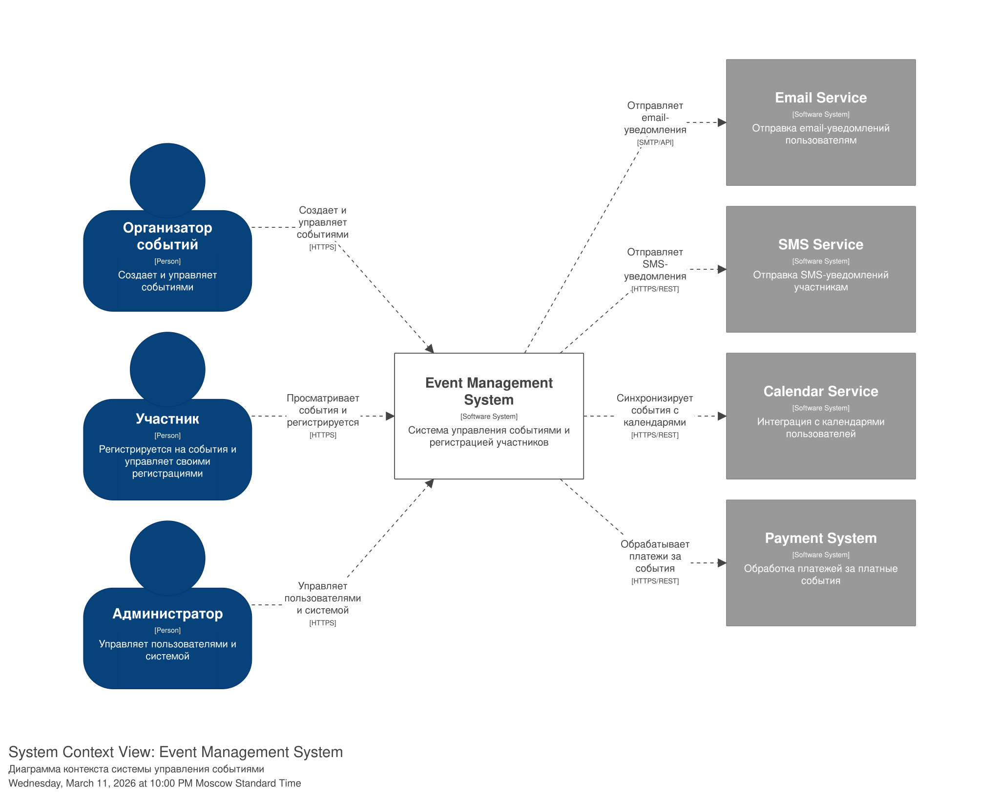
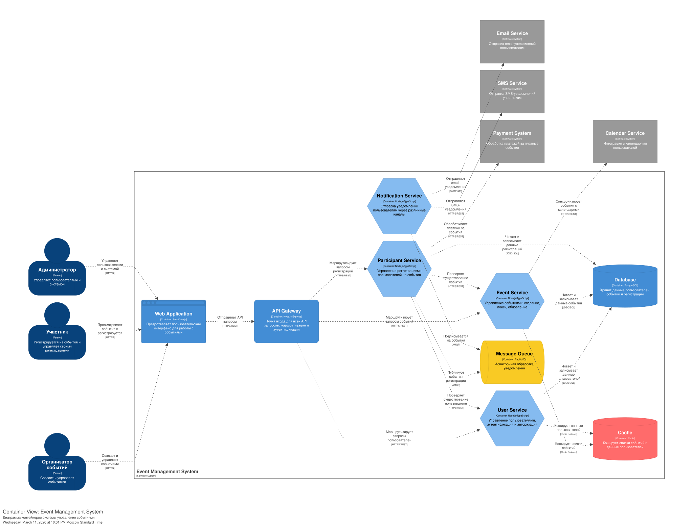
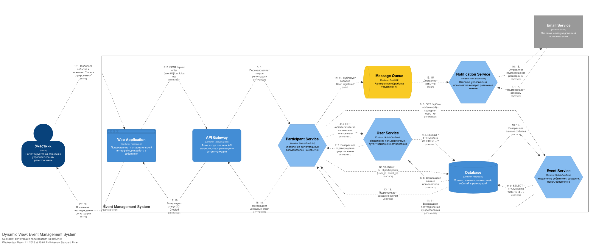
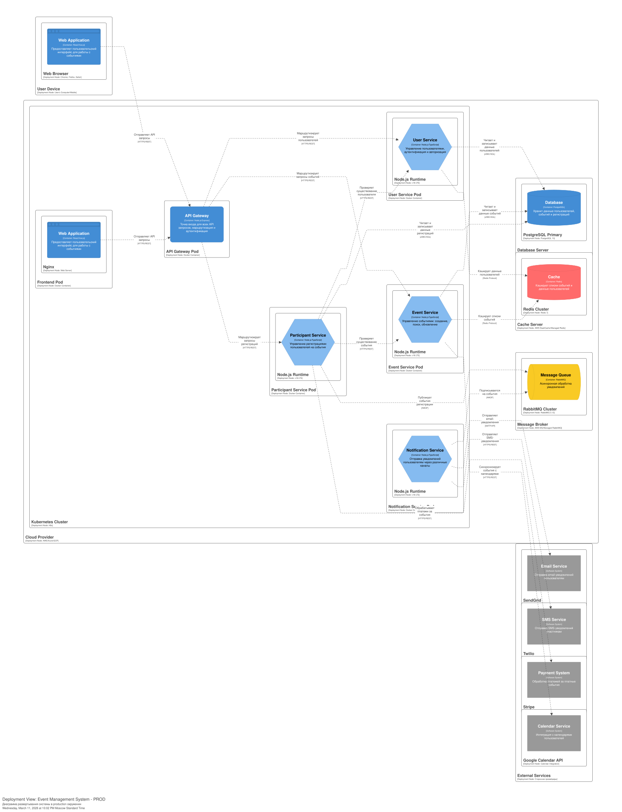

# Домашнее задание 01: Документирование архитектуры в Structurizr

## Вариант 22: Система управления событиями

### Описание системы

Система управления событиями представляет собой платформу для создания, поиска и управления событиями, а также регистрации участников. Сделан как анлог сервиса Eventbrite.

### Основные сущности

- Пользователь (Организатор, Участник, Администратор)
- Событие
- Участник события (регистрация)

### Реализуемое API

- Создание нового пользовталея
- Поиск пользователя по логину
- Поиск пользователя по маске имя и фамилия
- Создание события
- Получение списка событий
- Поиск событий по дате
- Регистрация пользователя на событие
- Получение участников события
- Получение событий пользователя
- Отмена регистрации на событие

---

## 1.

Требования к системе включают:

- Управление пользователями (создание, поиск, аутентификация)
- Управление событиями (CRUD операици, поиск по фильтрам)
- Управление регистрациями (запись, отмена, получение списков)
- Интеграция с внешними сервисами (почта, cмс, платежи, календари)

---

## 2. Роли пользователей и внешне системы

### Роли пользователей

| Роль | Описание |
|------|----------|
| Организатор событий | Создает и управляет событиями, редактирует информациб, контролирует список участников |
| Участник | Просматривает события, регистрируется на события, управляет своими регистрациями |
| Администратор | Управляет пользователями и системой, имеет доступ ко всем функциям платформы |

### Внешние системы

| Система | Назначение | Протокол |
|---------|-----------|----------|
| Email Service | Отправка email-уведомлений пользователям | SMTP/API |
| SMS Service | Отправка SMS-уведомлений участникам | HTTPS/REST |
| Payment System | Обработка платежей за платные события | HTTPS/REST |
| Calendar Service | Интеграция с календарями пользователей | HTTPS/REST |

---

## 3. Описание softwareSystem и диаграмма SystemContext

Диаграмма SystemContext (C1) показывает систему в контексте всех пользователей и внешних систем

Система взаимодействует с:

- Тремя ролями пользователей (Организатор, Участник, Администратор)
- Четырьмя внешними системами (почта, смски, платежка, календарь)

Все взаимодействия происходят через веб приложение по протоколу HTTPS



---

## 4. Основные задачи пользователей и их реализация

### Задачи Организатора

| Задача | Реализация |
|--------|-----------|
| Создание события | Event Service + Database |
| Редактирование события | Event Service + Database |
| Управление участниками | Participant Service + Database |
| Просмотр статистики | Event Service + Cache |

### Задачи Участника

| Задача | Реализация |
|--------|-----------|
| Поиск событий | Event Service + Cache + Database |
| Регистрация на событие | Participant Service + Payment System |
| Просмотр своих регистраций | Participant Service + Database |
| Отмена регистрации | Participant Service + Database |

### Задачи Администратора

| Задача | Реализация |
|--------|-----------|
| Управление пользователями | User Service + Database |
| Модерация событий | Event Service + Database |
| Системные настройки | User Service + Database |

---

## 5. Перечень контейнеров системы

| Контейнер | Технология | Назначение |
|-----------|-----------|------------|
| Web Application | React/Vue.js | Пользовательский интерфейс для работы с событиями |
| API Gateway | Node.js/Express | Точка входа для всех API запросов, маршрутизация и аунтефикация |
| User Service | Node.js/TypeScript | Управление пользователями, аутентификация и авторизация |
| Event Service | Node.js/TypeScript | Управление событиями: создание, поиск, обновление |
| Participant Service | Node.js/TypeScript | Управление регистрациями пользователей на события |
| Notification Service | Node.js/TypeScript | Отправка уведомлений пользователям через различные каналы |
| Database | PostgreSQL | Хранит данные пользователей, событий и регистраций |
| Cache | Redis | Кэширует списки событий и данные пользователей |
| Message Queue | RabbitMQ | Асинхронная обработка уведомлений |

---

## 6. Взаимодействие между контейнерами

### Основные сценарии взаимодействия

**Создание пользователя:**
```
Web Application -> API Gateway -> User Service -> Database
```

**Создание события:**
```
Web Application -> API Gateway -> Event Service -> Database
```

**Регистрация на событие:**
```
Web Application -> API Gateway -> Participant Service -> Event Service
Participant Service -> User Service -> Database
Participant Service -> Database -> Message Queue -> Notification Service
```

**Отправка уведомлений:**
```
Notification Service -> Message Queue -> Email Service / SMS Service
```

**Поиск событий:**
```
Web Application -> API Gateway -> Event Service -> Cache -> Database
```

---

## 7. Модель container в Structurizr DSL и диаграмма Container

Диаграмма Container (C2) показывает:

- Все 9 контейнеров 
- Взаимодействие
- Подключение к внешним системам
- Роли пользователей и энтрипоинты

Контейнеры организованы по микросвервисной архитектуре с разделением ответственности 



---

## 8. Технологии на контейнерах и связях

### Технологии контейнеров

| Контейнер | Технология | Тип |
|-----------|-----------|-----|
| Web Application | React/Vue.js | Web Browser |
| API Gateway | Node.js/Express | API |
| User Service | Node.js/TypeScript | Service |
| Event Service | Node.js/TypeScript | Service |
| Participant Service | Node.js/TypeScript | Service |
| Notification Service | Node.js/TypeScript | Service |
| Database | PostgreSQL | Database |
| Cache | Redis | Cache |
| Message Queue | RabbitMQ | Queue |

### Протоколы взаимодействия

| Связь | Протокол |
|-------|----------|
| Пользователь -> Web Application | HTTPS |
| Web Application -> API Gateway | HTTPS/REST |
| API Gateway -> Сервисы | HTTPS/REST |
| Сервисы -> Database | JDBC/SQL |
| Сервисы -> Cache | Redis Protocol |
| Сервисы -> Message Queue | AMQP |
| Notification Service -> Email Service | SMTP/API |
| Notification Service -> SMS Service | HTTPS/REST |
| Participant Service -> Payment System | HTTPS/REST |
| Event Service -> Calendar Service | HTTPS/REST |

---

## 9. Динамическая диаграмма для сценария регистрации

Выбран сценарий: Регистрация пользователя на событие

Диаграмма Dynamic показывает последовательность из 20 шагов:

1. Участник выбирает событие и нажимает Зарегистрироваться
2. Web Application отправляет POST запрос к API Gateway
3. API Gateway перенаправляет запрос в Participant Service
4. Participant Service проверяет существование пользователя через User Service
5. User Service запрашивает данные из Database
6. Database возвращает данные пользователя
7. User Service подтверждает существование пользователя
8. Participant Service проверяет существование события через Event Service
9. Event Service запрашивает данные из Database
10. Database возвращает данные события
11. Event Service подтверждает существование события
12. Participant Service создаёт запись регистрации в Database
13. Database подтверждает создание записи
14. Participant Service публикует событие UserRegistered в Message Queue
15. Message Queue доставляет событие в Notification Service
16. Notification Service отправляет подтверждение через Email Service
17. Email Service подтверждает отправку
18. Participant Service возвращает успешный ответ в API Gateway
19. API Gateway возвращает статус 201 Created в Web Application
20. Web Application показывает подтверждение регистрации участнику



---

## Архитектурные решения

### Стиль архитектуры

Микросервисная архитектура с использованием API Gateway для маршрутизации запросов. Сервисы разделены по доменным функциям (User, Event, Participant, Notification)

### Асинхронная обработка

Уведомления обрабатываются асинхронно через брокер сообщений (RabbitMQ). Это обеспечивает отказоустойчивость и возможность масштабирования компонента уведомлений независимо от основных сервисов

### Кэширование

Redis используется для кэширования частых запросов к спискам событий и данным пользователей. Это снижает нагрузку на базу данных и улучшает время отклика

### Развертывание

Система развертывается в Kubernetes кластере с отдельными подами для каждого сервиса. База данных использует схему Primary-Replica для обеспечения отказоустойчивости и масштабирования оперциии чтения

Диаграмма Deployment (C3) показывает развертывание в production окружении:



---
